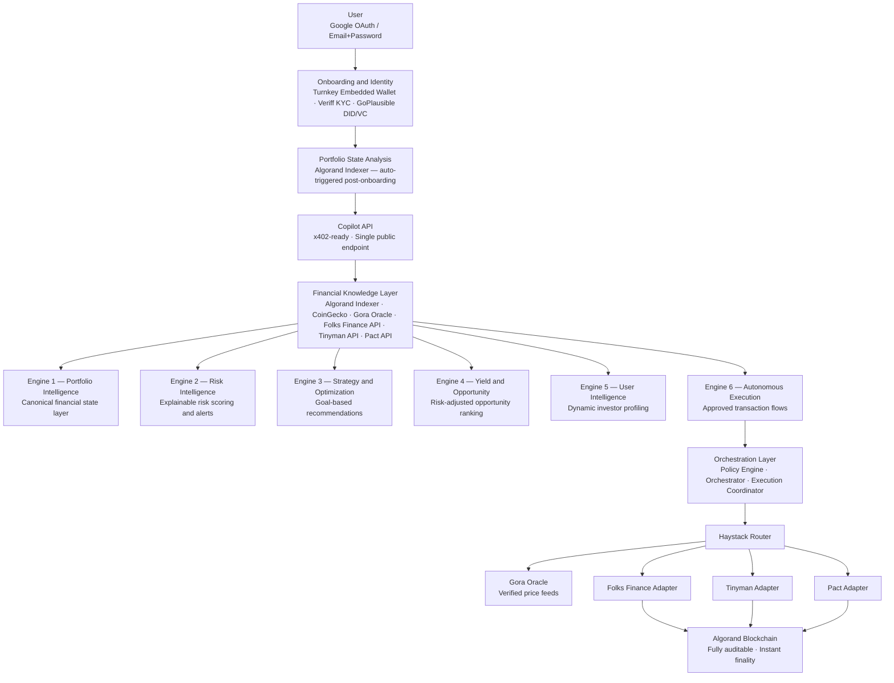
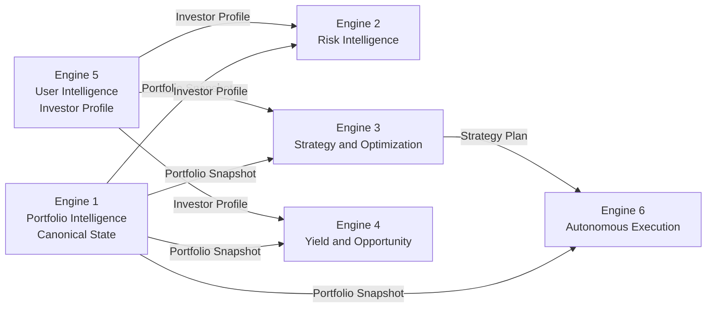
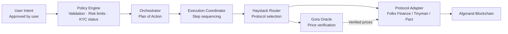

# CrestFlow

**AI-native financial intelligence and portfolio orchestration layer built on Algorand.**

CrestFlow is not a wallet. Not a DEX. Not a dashboard.

It is the **financial operating system** for on-chain users — transforming fragmented DeFi positions into actionable portfolio intelligence, risk-aware recommendations, and executed financial decisions through natural language.

---

## What CrestFlow Does

Traditional DeFi forces users to manually track multiple protocols, hunt for yield, monitor risk, and rebalance portfolios. CrestFlow abstracts all of that.

A user connects their wallet. CrestFlow handles the rest:

- Understands their entire on-chain financial state
- Analyzes portfolio risk across protocols
- Discovers yield opportunities ranked by quality, not raw APY
- Generates explainable strategy recommendations
- Executes approved actions through integrated protocols
- Answers any portfolio question in natural language

---

## System Architecture

> Architecture source of truth: [`system-architecture.png`](./project-context/system-architecture.png)



---

## Engine Data Contracts

Engine 1 is the **canonical state layer**. All downstream engines consume its output. No engine reads raw blockchain data directly.



---

## Execution Pipeline

Every execution action follows a strict, non-skippable sequence. No step can be bypassed.



> If Gora Oracle is unavailable, execution halts. Unverified prices are never used.

---

## Protocol Integrations

| Type | Protocol | Status |
|---|---|---|
| Embedded Wallet | Turnkey | Active |
| Lending | Folks Finance | Active |
| DEX / LP | Tinyman | Active |
| DEX / LP | Pact | Deferred — MVP+ |
| Oracle | Gora Oracle | Active |
| Market Data | CoinGecko | Active |
| On-chain Data | Algorand Indexer | Active |

---

## MVP Scope

The MVP is the **first complete implementation** of the Financial Intelligence Layer — with fewer protocol integrations, not reduced intelligence depth.

### In Scope

| Priority | Module |
|---|---|
| P0 | Auth + Turnkey embedded wallet |
| P0 | Portfolio Intelligence Engine |
| P0 | Risk Intelligence Engine |
| P0 | Yield and Opportunity Engine |
| P0 | AI Copilot |
| P0 | Copilot API |
| P1 | User Intelligence Engine |
| P1 | Strategy and Optimization Engine |
| P1 | Basic Execution Engine |
| P1 | Policy Engine + Orchestrator + Execution Coordinator |
| P1 | Haystack Router |
| P1 | Gora Oracle integration |
| P1 | Veriff KYC + GoPlausible DID/VC |

### Out of Scope

| Excluded | Deferred To |
|---|---|
| Autonomous execution / Autopilot | Phase 3 |
| Multi-chain support | Phase 3 |
| Multi-agent orchestration | Phase 3 |
| Institutional workflows | Phase 3 |
| x402 live monetization | Phase 2 |

---

## Engineering Principles

```
Correctness > Reliability > Maintainability > Performance
```

- **Modular** — Each engine is independently deployable. No engine depends on another's internal implementation.
- **API-first** — All intelligence is exposed as REST APIs, versioned and documented.
- **MCP-compatible** — All capabilities are designed to be accessible to external AI agents.
- **Non-custodial** — Private keys never touch CrestFlow servers. Turnkey architecture enforced throughout.
- **Explainable** — Every AI output includes reason, confidence level, assumptions, and expected outcome. No black-box decisions.
- **Decimal arithmetic** — All monetary calculations use decimal types. Floating point is forbidden.
- **Policy Engine mandatory** — No execution action bypasses the guardrail layer.

---

## Repository Structure

```
CrestFlow-Platform/
├── system-architecture.png                  # Architecture source of truth
├── project-context/
│   ├── context.md                 # Platform context and philosophy
│   ├── prd.md                     # Product Requirements Document
│   ├── srs.md                     # Software Requirements Specification
│   ├── flow.md                    # User and system flows
│   ├── mvp-context.md             # MVP scope, priorities, and definition of done
│   ├── instructions.md            # Engineering instructions for agents and developers
│   ├── architecture.md            # Architecture notes
│   └── design.md                  # Design notes
```

---

## MVP Definition of Done

The MVP is complete when a user can:

1. Sign up and receive a Turnkey embedded Algorand wallet
2. Import their complete portfolio — native assets, Folks Finance positions, Tinyman LP positions
3. View portfolio health score with per-component breakdown
4. View risk score with full decomposition — understand which factors drove it
5. View yield opportunities ranked by risk-adjusted APY, not raw APY
6. Receive AI-generated, explainable strategy recommendations
7. Simulate an action before committing
8. Execute a Folks Finance or Tinyman action with wallet approval
9. Ask any portfolio question in natural language and receive a sourced answer
10. Receive alerts when risk thresholds are breached

---

## Non-Negotiables

| Rule | Reason |
|---|---|
| Never fabricate financial data | Financial systems require factual, sourced outputs |
| Never bypass user approval for execution | Users must authorize every transaction |
| Never use floating point for monetary values | Precision loss causes silent financial errors |
| Never skip the Policy Engine | Guardrails protect users from unauthorized execution |
| Always produce explainable AI outputs | No black-box financial decisions |
| Always use Gora Oracle prices during execution | Unverified prices cause incorrect transactions |
| Always consume Engine 1 output in downstream engines | Engine 1 owns portfolio truth |

---

*CrestFlow — Financial intelligence layer for Algorand.*
