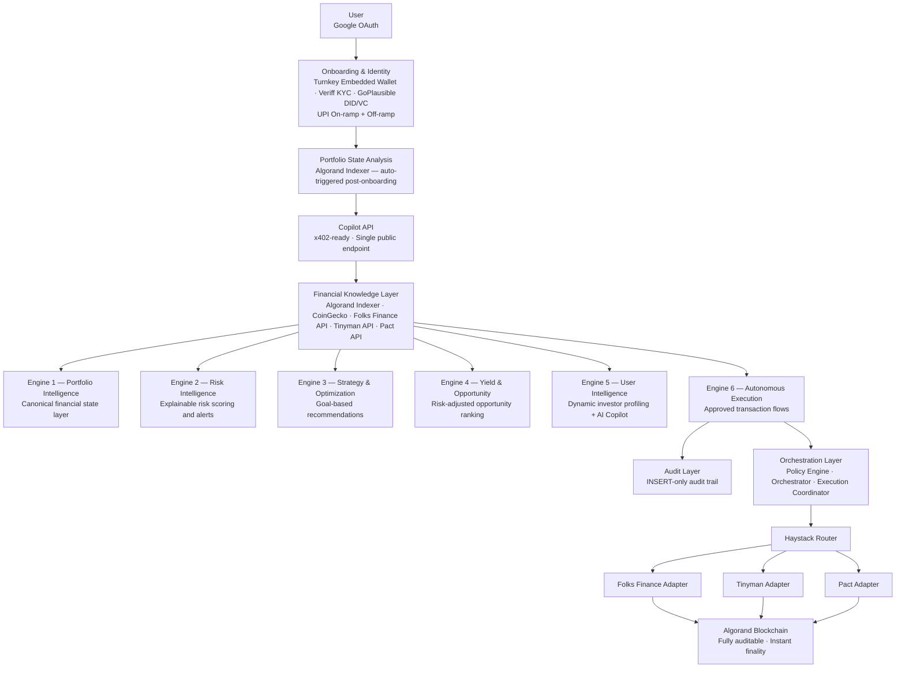
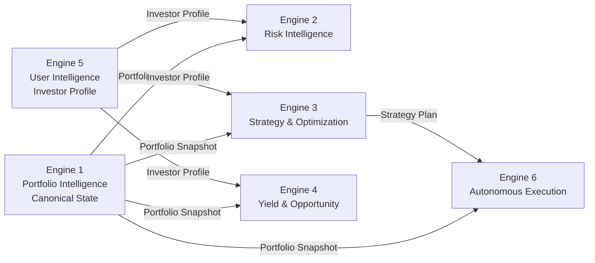

# CrestFlow

**AI-native financial intelligence and portfolio orchestration layer built on Algorand.**

CrestFlow is not a wallet. Not a DEX. Not a dashboard.

It is the **financial operating system** for on-chain users — transforming fragmented DeFi positions into actionable portfolio intelligence, risk-aware recommendations, and executed financial decisions through natural language.

---

## What CrestFlow Does

Traditional DeFi forces users to manually track multiple protocols, hunt for yield, monitor risk, and rebalance portfolios. CrestFlow abstracts all of that.

A user connects their wallet. CrestFlow handles the rest:

- Understands their entire on-chain financial state
- Analyzes portfolio risk across protocols
- Discovers yield opportunities ranked by quality, not raw APY
- Generates explainable strategy recommendations
- Executes approved actions through integrated protocols
- Answers any portfolio question in natural language
- Provides full audit trail for every financial action

---

## System Architecture

> Architecture source of truth: [`system-architecture.png`](./project-context/system-architecture.png)



---

## Engine Data Contracts

Engine 1 is the **canonical state layer**. All downstream engines consume its output. No engine reads raw blockchain data directly.



---

## Execution Pipeline

Every execution action follows a strict, non-skippable sequence. No step can be bypassed.


> CoinGecko provides pricing for display. Simulation against live chain state (algod) proves correctness before every broadcast. Gora Oracle is P2.

---

## Implementation Plans

All 11 plans are written and approved. Implementation not yet started.

| Plan | Module | Priority | Key Deliverables |
|---|---|---|---|
| [01](./plans/01-auth-turnkey-onboarding.md) | Auth + Turnkey Onboarding | P0 | Google OAuth, Turnkey sub-org, Algorand wallet creation, JWT |
| [02](./plans/02-financial-knowledge-layer.md) | Financial Knowledge Layer | P0 | Algorand Indexer, CoinGecko, Folks/Tinyman/Pact adapters, Redis cache |
| [03](./plans/03-engine1-portfolio-intelligence.md) | Engine 1 — Portfolio Intelligence | P0 | IL calc, HHI, health score (0–100), immutable snapshots, 7 APIs |
| [04](./plans/04-engine2-risk-intelligence.md) | Engine 2 — Risk Intelligence | P0 | CVaR, Sortino, MDD, liquidation monitoring, 8 alert types, 6 APIs |
| [05](./plans/05-engine3-strategy-optimization.md) | Engine 3 — Strategy & Optimization | P0 | HRP+CVaR ensemble, Ledoit-Wolf, goal constraints, rebalancing, 7 APIs |
| [06](./plans/06-engine4-yield-opportunity.md) | Engine 4 — Yield & Opportunity | P0 | TOPSIS ranking, IL-adjusted yield, idle capital detection, 7 APIs |
| [07](./plans/07-engine5-user-intelligence.md) | Engine 5 — User Intelligence & Copilot | P0 | 5 personas, drift scoring, GPT-4.1-mini + Gemini Flash fallback, SSE, 7 APIs |
| [08](./plans/08-engine6-autonomous-execution.md) | Engine 6 — Autonomous Execution | P0 | 7 action types, Policy Engine, simulation gate, Turnkey signing, 7 APIs |
| [09](./plans/09-audit-layer.md) | Audit Layer | P0 | INSERT-only audit, 10 event categories, DB-level immutability, 4 APIs |
| [10](./plans/10-kyc-identity-p1.md) | KYC & Identity | P1 | Veriff KYC, GoPlausible DID/VC, UPI on-ramp + off-ramp, 9 APIs |
| [11](./plans/11-x402-gateway-policy.md) | x402 Gateway Policy | P1 | 13 paid endpoints ($0.005–$0.10 USDC), 42 free, Goplusfable facilitator |

---

## Protocol Integrations

| Type | Integration | Status |
|---|---|---|
| Embedded Wallet | Turnkey TEE | P0 — planned |
| Lending | Folks Finance | P0 — planned |
| DEX / Swap | Haystack Router (Tinyman + Pact aggregation) | P0 — planned |
| DEX / LP | Tinyman V2 | P0 — planned |
| DEX / LP | Pact | P0 — planned |
| KYC | Veriff (doc + liveness + AML) | P1 — planned |
| Decentralised Identity | GoPlausible (DID + VC) | P1 — planned |
| Fiat On-Ramp | Transak / Ramp Network (INR → USDC) | P1 — planned |
| Fiat Off-Ramp | Transak / Ramp Network (USDC → INR) | P1 — planned |
| x402 Payments | Goplusfable Facilitator | P1 — planned |
| AI — Primary | GPT-4.1-mini (OpenAI) | P0 — planned |
| AI — Fallback | Gemini 3.5 Flash | P0 — planned |
| Market Data | CoinGecko | P0 — planned |
| On-chain Data | Algorand Indexer | P0 — planned |
| Oracle | Gora Oracle | P2 — stub only in MVP |

---

## MVP Scope

The MVP is the **first complete implementation** of the Financial Intelligence Layer — with fewer protocol integrations, not reduced intelligence depth.

### In Scope (P0 — must ship for MVP to function)

| Module | Plan |
|---|---|
| Auth + Turnkey embedded wallet | Plan 01 |
| Financial Knowledge Layer (adapters + cache) | Plan 02 |
| Engine 1 — Portfolio Intelligence | Plan 03 |
| Engine 2 — Risk Intelligence | Plan 04 |
| Engine 3 — Strategy & Optimization | Plan 05 |
| Engine 4 — Yield & Opportunity | Plan 06 |
| Engine 5 — User Intelligence & AI Copilot | Plan 07 |
| Engine 6 — Autonomous Execution | Plan 08 |
| Audit Layer | Plan 09 |

### In Scope (P1 — must ship before production launch)

| Module | Plan |
|---|---|
| KYC (Veriff) + DID/VC (GoPlausible) + On/Off-ramp | Plan 10 |
| x402 Payment Gateway (Goplusfable) | Plan 11 |

### Deferred

| Item | When |
|---|---|
| Gora Oracle (full integration) | P2 |
| MCP Server | P2 |
| Monte Carlo / Cornish-Fisher CVaR | P2 |
| Multi-chain support | Phase 2 |
| Institutional workflows | Phase 2 |
| RWA integrations | Phase 2 |
| CREST Token + open-source SDK | Phase 3 |

> See [`future-plans.md`](./project-context/future-plans.md) for full P2/Phase 2/Phase 3 roadmap.

---

## Project Context Files

All documentation lives in [`project-context/`](./project-context/).

| File | Purpose |
|---|---|
| [`context.md`](./project-context/context.md) | Platform identity, philosophy, target users, what CrestFlow is and is not |
| [`prd.md`](./project-context/prd.md) | Product Requirements Document — features, user stories, success metrics, roadmap |
| [`srs.md`](./project-context/srs.md) | Software Requirements Specification — detailed functional + non-functional requirements |
| [`flow.md`](./project-context/flow.md) | User and system flows — 20 flows from onboarding to execution to MCP access |
| [`architecture.md`](./project-context/architecture.md) | Prisma schema for all domains — canonical DB reference |
| [`mvp-context.md`](./project-context/mvp-context.md) | MVP scope, priorities, module specs, definition of done |
| [`instructions.md`](./project-context/instructions.md) | Engineering rules for agents and developers — authoritative behavioral constraints |
| [`frontend-context.md`](./project-context/frontend-context.md) | Frontend UX/API specs per engine — what each screen shows and which endpoints it calls |
| [`tasks.md`](./project-context/tasks.md) | Living task list — P0/P1/P2/Phase 3 items with plan linkage |
| [`progress.md`](./project-context/progress.md) | Milestone log and integration status — updated per sprint |
| [`test.md`](./project-context/test.md) | Test registry — 200+ test cases across all 11 plans |
| [`future-plans.md`](./project-context/future-plans.md) | P2, Phase 2, Phase 3 features — MCP, multi-chain, RWA, CREST token |
| [`design.md`](./project-context/design.md) | Design system notes |
| [`system-architecture.png`](./project-context/system-architecture.png) | Architecture diagram — primary source of truth for all implementation decisions |

---

## Repository Structure

```
CrestFlow-Platform/
├── README.md
├── project-context/
│   ├── system-architecture.png   # Architecture source of truth
│   ├── context.md                # Platform identity and philosophy
│   ├── prd.md                    # Product Requirements Document
│   ├── srs.md                    # Software Requirements Specification
│   ├── flow.md                   # User and system flows (20 flows)
│   ├── architecture.md           # Prisma schema — all domain models
│   ├── mvp-context.md            # MVP scope and definition of done
│   ├── instructions.md           # Engineering rules for agents/developers
│   ├── frontend-context.md       # Frontend UX + API specs per engine
│   ├── tasks.md                  # Task list (P0 → Phase 3)
│   ├── progress.md               # Milestone log and integration status
│   ├── test.md                   # Test registry (200+ test cases)
│   ├── future-plans.md           # P2 / Phase 2 / Phase 3 roadmap
│   └── design.md                 # Design system notes
└── plans/
    ├── 01-auth-turnkey-onboarding.md
    ├── 02-financial-knowledge-layer.md
    ├── 03-engine1-portfolio-intelligence.md
    ├── 04-engine2-risk-intelligence.md
    ├── 05-engine3-strategy-optimization.md
    ├── 06-engine4-yield-opportunity.md
    ├── 07-engine5-user-intelligence.md
    ├── 08-engine6-autonomous-execution.md
    ├── 09-audit-layer.md
    ├── 10-kyc-identity-p1.md
    └── 11-x402-gateway-policy.md
```

---

## Engineering Principles

```
Correctness > Reliability > Maintainability > Performance
```

- **Modular** — Each engine is independently deployable. No engine depends on another's internals.
- **API-first** — All intelligence exposed as versioned REST APIs.
- **Non-custodial** — Private keys never touch CrestFlow servers. Turnkey TEE enforced throughout.
- **Explainable** — Every AI output includes reason, confidence, assumptions, and expected outcome.
- **Decimal arithmetic** — All monetary values use `decimal.js`. Floating point is forbidden.
- **Policy Engine mandatory** — No execution action bypasses the guardrail layer.
- **INSERT-only audit** — Every financial action produces an immutable audit record.
- **Fail-closed** — Simulation must pass before any transaction is signed. No simulation = no execution.

---

## Non-Negotiables

| Rule | Reason |
|---|---|
| Never fabricate financial data | Financial systems require factual, sourced outputs |
| Never bypass user approval for execution | Users must authorize every transaction |
| Never use floating point for monetary values | Precision loss causes silent financial errors |
| Never skip the Policy Engine | Guardrails protect users from unauthorized execution |
| Never sign without simulation passing | Prevents on-chain failures and fund loss |
| Always produce explainable AI outputs | No black-box financial decisions |
| Always consume Engine 1 output in downstream engines | Engine 1 owns portfolio truth |
| Always write an audit entry for every financial action | Compliance and trust require full traceability |

---

*CrestFlow — Financial intelligence layer for Algorand.*
