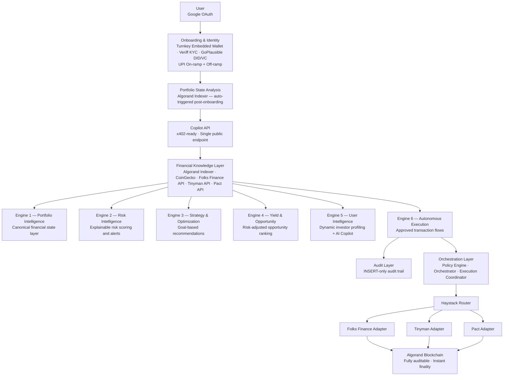
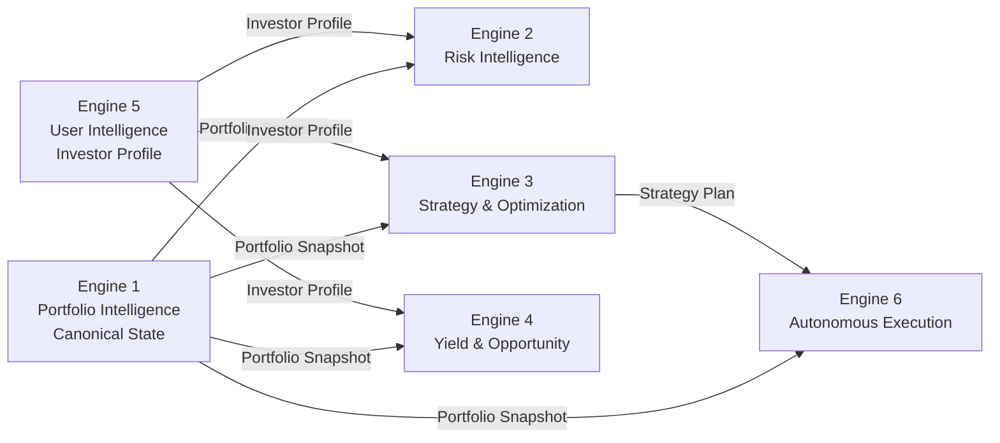

# CrestFlow

**AI-native financial intelligence and portfolio orchestration layer built on Algorand.**

CrestFlow is not a wallet. Not a DEX. Not a dashboard.

It is the **financial operating system** for on-chain users — transforming fragmented DeFi positions into actionable portfolio intelligence, risk-aware recommendations, and executed financial decisions through natural language.

---

## What CrestFlow Does

Traditional DeFi forces users to manually track multiple protocols, hunt for yield, monitor risk, and rebalance portfolios. CrestFlow abstracts all of that.

A user connects their wallet. CrestFlow handles the rest:

- Understands their entire on-chain financial state
- Analyzes portfolio risk across protocols
- Discovers yield opportunities ranked by quality, not raw APY
- Generates explainable strategy recommendations
- Executes approved actions through integrated protocols
- Answers any portfolio question in natural language
- Provides full audit trail for every financial action

---

## System Architecture

> Architecture source of truth: [`system-architecture.png`](./project-context/system-architecture.png)



---

## Engine Data Contracts

Engine 1 is the **canonical state layer**. All downstream engines consume its output. No engine reads raw blockchain data directly.



---

## Execution Pipeline

Every execution action follows a strict, non-skippable sequence. No step can be bypassed.


> CoinGecko provides pricing for display. Simulation against live chain state (algod) proves correctness before every broadcast. Gora Oracle is P2.

---

## Implementation Plans

All 11 plans are written and approved. Plans are the technical source of truth for implementation — each covers schema, logic, APIs, and tests for its module.

> Status: All plans approved. Implementation not yet started.

### Foundation (build these first — everything else depends on them)

| Plan | What it does |
|---|---|
| [Plan 01 — Auth + Wallet](./plans/01-auth-turnkey-onboarding.md) | Signs users in via Google OAuth. Creates an embedded Algorand wallet per user using Turnkey TEE — no private keys ever touch CrestFlow servers. |
| [Plan 02 — Financial Knowledge Layer](./plans/02-financial-knowledge-layer.md) | The shared data layer all engines read from. Adapters for Algorand Indexer, CoinGecko, Folks Finance, Tinyman, and Pact. Results are Redis-cached so engines don't call external APIs on every request. |

### Intelligence Engines (the core product — what makes CrestFlow useful)

| Plan | What it does |
|---|---|
| [Plan 03 — Portfolio Intelligence](./plans/03-engine1-portfolio-intelligence.md) | Reads a user's Algorand address and produces a complete, normalized picture of their financial state: what they own, what protocols they're in, what yield they're earning, what their real asset exposure is after decomposing LP tokens. Produces a health score (0–100). |
| [Plan 04 — Risk Intelligence](./plans/04-engine2-risk-intelligence.md) | Quantifies how risky the portfolio actually is. Calculates tail risk (CVaR), volatility, drawdown, Sortino ratio, and liquidation proximity for Folks Finance positions. Fires alerts when thresholds are breached. |
| [Plan 05 — Strategy & Optimization](./plans/05-engine3-strategy-optimization.md) | Recommends what the portfolio allocation *should* look like given the user's goal. Uses HRP + CVaR ensemble optimizer with Ledoit-Wolf shrinkage. Generates specific rebalancing actions with drift urgency tiers. |
| [Plan 06 — Yield & Opportunity](./plans/06-engine4-yield-opportunity.md) | Finds the best yield opportunities across Folks Finance and Tinyman. Adjusts raw APY for impermanent loss, consistency, and protocol risk using TOPSIS ranking. Flags idle capital sitting in wallets that could be deployed. |
| [Plan 07 — User Intelligence & Copilot](./plans/07-engine5-user-intelligence.md) | Builds a dynamic investor profile for each user based on their questionnaire answers and actual behavior. Powers the AI Copilot — the natural language interface over all engines — using GPT-4.1-mini with Gemini Flash as fallback. |

### Execution Layer (where intelligence becomes action)

| Plan | What it does |
|---|---|
| [Plan 08 — Autonomous Execution](./plans/08-engine6-autonomous-execution.md) | Takes a strategy recommendation and turns it into actual on-chain transactions. Runs every action through a Policy Engine (risk limits, KYC, protocol allowlist, slippage caps), simulates against live chain state, then signs via Turnkey and broadcasts to Algorand. |
| [Plan 09 — Audit Layer](./plans/09-audit-layer.md) | Writes an immutable record of every financial event — portfolio scans, risk alerts, execution outcomes, KYC events. Records are INSERT-only at the database level. No record can be altered or deleted. |

### Compliance & Monetization (required before production launch)

| Plan | What it does |
|---|---|
| [Plan 10 — KYC & Identity](./plans/10-kyc-identity-p1.md) | Runs users through Veriff document verification and liveness check. On approval, issues a decentralised identity (DID) and KYC credential (VC) via GoPlausible on Algorand. Enables UPI fiat on-ramp (INR → USDC) and off-ramp (USDC → INR) via Transak. KYC is the gate before any execution. |
| [Plan 11 — x402 Gateway](./plans/11-x402-gateway-policy.md) | Defines which API endpoints cost money and which are free. Computation-heavy endpoints (execution, strategy, copilot queries) cost $0.005–$0.10 USDC per call, paid via HTTP 402 before the request is processed. Read-only endpoints are free. 13 paid, 42 free. |

---

## Protocol Integrations

| Type | Integration | Status |
|---|---|---|
| Embedded Wallet | Turnkey TEE | P0 — planned |
| Lending | Folks Finance | P0 — planned |
| DEX / Swap | Haystack Router (Tinyman + Pact aggregation) | P0 — planned |
| DEX / LP | Tinyman V2 | P0 — planned |
| DEX / LP | Pact | P0 — planned |
| KYC | Veriff (doc + liveness + AML) | P1 — planned |
| Decentralised Identity | GoPlausible (DID + VC) | P1 — planned |
| Fiat On-Ramp | Transak / Ramp Network (INR → USDC) | P1 — planned |
| Fiat Off-Ramp | Transak / Ramp Network (USDC → INR) | P1 — planned |
| x402 Payments | Goplusfable Facilitator | P1 — planned |
| AI — Primary | GPT-4.1-mini (OpenAI) | P0 — planned |
| AI — Fallback | Gemini 3.5 Flash | P0 — planned |
| Market Data | CoinGecko | P0 — planned |
| On-chain Data | Algorand Indexer | P0 — planned |
| Oracle | Gora Oracle | P2 — stub only in MVP |

---

## MVP Scope

The MVP is the **first complete implementation** of the Financial Intelligence Layer — with fewer protocol integrations, not reduced intelligence depth.

### In Scope (P0 — must ship for MVP to function)

| Module | Plan |
|---|---|
| Auth + Turnkey embedded wallet | Plan 01 |
| Financial Knowledge Layer (adapters + cache) | Plan 02 |
| Engine 1 — Portfolio Intelligence | Plan 03 |
| Engine 2 — Risk Intelligence | Plan 04 |
| Engine 3 — Strategy & Optimization | Plan 05 |
| Engine 4 — Yield & Opportunity | Plan 06 |
| Engine 5 — User Intelligence & AI Copilot | Plan 07 |
| Engine 6 — Autonomous Execution | Plan 08 |
| Audit Layer | Plan 09 |

### In Scope (P1 — must ship before production launch)

| Module | Plan |
|---|---|
| KYC (Veriff) + DID/VC (GoPlausible) + On/Off-ramp | Plan 10 |
| x402 Payment Gateway (Goplusfable) | Plan 11 |

### Deferred

| Item | When |
|---|---|
| Gora Oracle (full integration) | P2 |
| MCP Server | P2 |
| Monte Carlo / Cornish-Fisher CVaR | P2 |
| Multi-chain support | Phase 2 |
| Institutional workflows | Phase 2 |
| RWA integrations | Phase 2 |
| CREST Token + open-source SDK | Phase 3 |

> See [`future-plans.md`](./project-context/future-plans.md) for full P2/Phase 2/Phase 3 roadmap.

---

## Project Context Files

All documentation lives in [`project-context/`](./project-context/). Here is what each file is for and when to read it.

### Read to understand the product

| File | What it answers |
|---|---|
| [context.md](./project-context/context.md) | *What is CrestFlow and who is it for?* — Platform identity, philosophy, and target personas. Start here if you're new. |
| [prd.md](./project-context/prd.md) | *What does the product do?* — Feature specs, user stories, roadmap phases, success metrics, monetization model. |
| [flow.md](./project-context/flow.md) | *How does everything connect?* — 20 user and system flows from signup to execution to external API access. |
| [future-plans.md](./project-context/future-plans.md) | *What comes after MVP?* — P2 items (Gora, MCP, Monte Carlo), Phase 2 (multi-chain), Phase 3 (CREST token, SDK, mobile). |

### Read to build

| File | What it answers |
|---|---|
| [instructions.md](./project-context/instructions.md) | *How must I write this code?* — Authoritative engineering rules covering decimal arithmetic, error handling, naming, schema conventions, and what is strictly forbidden. Read this before writing any code. |
| [architecture.md](./project-context/architecture.md) | *What does the database look like?* — Canonical Prisma schema for every domain: users, portfolios, risk, strategy, yield, execution, audit, KYC, on/off-ramp. Source of truth for all DB work. |
| [srs.md](./project-context/srs.md) | *What are the exact requirements?* — Numbered functional and non-functional requirements per subsystem (REQ-AUTH-01, REQ-PIE-01, etc.). |
| [mvp-context.md](./project-context/mvp-context.md) | *What does done look like for MVP?* — Module-by-module MVP definition, priority tiers, and the 10 user-facing success criteria. |
| [frontend-context.md](./project-context/frontend-context.md) | *What does each screen show and which APIs does it call?* — Per-engine UX specs for the frontend team. |
| [design.md](./project-context/design.md) | *What are the design conventions?* — Colour palette, typography, component patterns, spacing system. |

### Read to track progress

| File | What it answers |
|---|---|
| [tasks.md](./project-context/tasks.md) | *What still needs to be built?* — Full task list from P0 through Phase 3, each item linked to its source plan. Updated as work progresses. |
| [progress.md](./project-context/progress.md) | *What has been decided or completed?* — Milestone log, integration status, key architectural decisions with rationale. |
| [test.md](./project-context/test.md) | *What must be tested and how?* — 200+ test cases across all 11 plans, covering unit, integration, security, financial computation standards, and API contracts. |

---

## Repository Structure

```
CrestFlow-Platform/
├── README.md
├── project-context/
│   ├── system-architecture.png   # Architecture source of truth
│   ├── context.md                # Platform identity and philosophy
│   ├── prd.md                    # Product Requirements Document
│   ├── srs.md                    # Software Requirements Specification
│   ├── flow.md                   # User and system flows (20 flows)
│   ├── architecture.md           # Prisma schema — all domain models
│   ├── mvp-context.md            # MVP scope and definition of done
│   ├── instructions.md           # Engineering rules for agents/developers
│   ├── frontend-context.md       # Frontend UX + API specs per engine
│   ├── tasks.md                  # Task list (P0 → Phase 3)
│   ├── progress.md               # Milestone log and integration status
│   ├── test.md                   # Test registry (200+ test cases)
│   ├── future-plans.md           # P2 / Phase 2 / Phase 3 roadmap
│   └── design.md                 # Design system notes
└── plans/
    ├── 01-auth-turnkey-onboarding.md
    ├── 02-financial-knowledge-layer.md
    ├── 03-engine1-portfolio-intelligence.md
    ├── 04-engine2-risk-intelligence.md
    ├── 05-engine3-strategy-optimization.md
    ├── 06-engine4-yield-opportunity.md
    ├── 07-engine5-user-intelligence.md
    ├── 08-engine6-autonomous-execution.md
    ├── 09-audit-layer.md
    ├── 10-kyc-identity-p1.md
    └── 11-x402-gateway-policy.md
```

---

## Engineering Principles

```
Correctness > Reliability > Maintainability > Performance
```

- **Modular** — Each engine is independently deployable. No engine depends on another's internals.
- **API-first** — All intelligence exposed as versioned REST APIs.
- **Non-custodial** — Private keys never touch CrestFlow servers. Turnkey TEE enforced throughout.
- **Explainable** — Every AI output includes reason, confidence, assumptions, and expected outcome.
- **Decimal arithmetic** — All monetary values use `decimal.js`. Floating point is forbidden.
- **Policy Engine mandatory** — No execution action bypasses the guardrail layer.
- **INSERT-only audit** — Every financial action produces an immutable audit record.
- **Fail-closed** — Simulation must pass before any transaction is signed. No simulation = no execution.

---

## Non-Negotiables

| Rule | Reason |
|---|---|
| Never fabricate financial data | Financial systems require factual, sourced outputs |
| Never bypass user approval for execution | Users must authorize every transaction |
| Never use floating point for monetary values | Precision loss causes silent financial errors |
| Never skip the Policy Engine | Guardrails protect users from unauthorized execution |
| Never sign without simulation passing | Prevents on-chain failures and fund loss |
| Always produce explainable AI outputs | No black-box financial decisions |
| Always consume Engine 1 output in downstream engines | Engine 1 owns portfolio truth |
| Always write an audit entry for every financial action | Compliance and trust require full traceability |

---

*CrestFlow — Financial intelligence layer for Algorand.*
